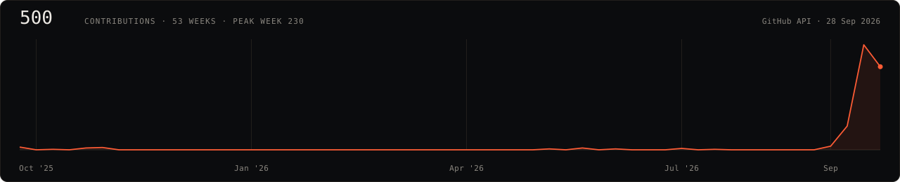

# Aashish Mahato

**Systems Architect · AI Integration Engineer**

B.Tech CSE (VIT Vellore) · Kathmandu, Nepal · Nova ·
[LinkedIn](https://www.linkedin.com/in/aashish-mahato-572611257) ·
[LeetCode](https://leetcode.com/u/aashish124) ·
[burn live docs](https://aashish254.github.io/burn/) ·
[limen live docs](https://aashish254.github.io/limen/)



I build local-first AI tooling — inference runtimes, cost ledgers, agent
guardrails — and ship it upstream rather than parking it in a fork.

**75 pull requests merged into other people's projects in September 2026**,
+19,559 / −857 lines across 334 files. 64 of them into
[Laya](https://github.com/NandhaKishorM/laya), a 28k-star non-autoregressive
decision engine whose contributor graph puts me first outside its owner: 117
contributions, against 37 for the next external name.

Every figure on this page was pulled from the public GitHub API on
**28 Sep 2026**. The exact queries are at the
[bottom](#receipts) — re-run them, and if a number has drifted, the query is
still the truth.

---

## Upstream

| Project                                                                                           |     ★ | Merged | Open now | Lines landed       |
| ------------------------------------------------------------------------------------------------- | ----: | -----: | -------: | ------------------ |
| [NandhaKishorM/laya](https://github.com/NandhaKishorM/laya)                                       | 28.0k | **64** |        8 | +19,379 / −823     |
| [freeCodeCamp/freeCodeCamp](https://github.com/freeCodeCamp/freeCodeCamp)                         |  456k |      4 |        4 | +11 / −11          |
| [mdn/content](https://github.com/mdn/content)                                                     | 11.0k |      3 |        0 | +10 / −10          |
| [mdn/browser-compat-data](https://github.com/mdn/browser-compat-data)                             |  5.8k |      1 |        0 | +1 / −2            |
| [tt-a1i/archify](https://github.com/tt-a1i/archify)                                               | 73.8k |      1 |        0 | +96 / −4           |
| [PyCQA/flake8-bugbear](https://github.com/PyCQA/flake8-bugbear)                                   |  1.1k |      1 |        0 | +49 / −7           |
| [StellarCanary/ProtocolCanary-Fixtures](https://github.com/StellarCanary/ProtocolCanary-Fixtures) |     4 |      1 |        0 | +13                |
| **Total**                                                                                         |       | **75** |       12 | **+19,559 / −857** |

### What landed in Laya

Laya answers with one forward pass instead of autoregressive decoding, so
throughput and correctness of the decision surface are the whole product. That
is what I worked on.

- **Batching and long-document parity across every backend** —
  [`ONNXAgent.predict_batch`](https://github.com/NandhaKishorM/laya/pull/489),
  [`predict_long`](https://github.com/NandhaKishorM/laya/pull/494),
  [`sort_by_length` on ONNX](https://github.com/NandhaKishorM/laya/pull/507),
  [`decide_batch`](https://github.com/NandhaKishorM/laya/pull/520),
  [tokenize once per call](https://github.com/NandhaKishorM/laya/pull/309),
  [cached shortlist embeddings](https://github.com/NandhaKishorM/laya/pull/405)
- **MCP surface** — [`laya_decide`](https://github.com/NandhaKishorM/laya/pull/516),
  [`laya_predict_batch` / `laya_route_batch`](https://github.com/NandhaKishorM/laya/pull/513),
  [`laya_shortlist`](https://github.com/NandhaKishorM/laya/pull/404),
  [task / lang / max_len controls](https://github.com/NandhaKishorM/laya/pull/567)
- **TypeScript SDK parity with the Python core** —
  [hooks lifecycle](https://github.com/NandhaKishorM/laya/pull/308),
  [structured decisions](https://github.com/NandhaKishorM/laya/pull/339),
  [`BaseHook` + process-wide defaults](https://github.com/NandhaKishorM/laya/pull/321),
  [per-language temperatures](https://github.com/NandhaKishorM/laya/pull/398),
  [mixed-script routing fixes](https://github.com/NandhaKishorM/laya/pull/307)
- **LangChain integration** — [batch answers on shared forward
  passes](https://github.com/NandhaKishorM/laya/pull/522),
  [`LayaDecision`](https://github.com/NandhaKishorM/laya/pull/524),
  [token budget forwarding](https://github.com/NandhaKishorM/laya/pull/530)
- **CLI** — [run Laya locally](https://github.com/NandhaKishorM/laya/pull/155),
  [score a file or stdin in one batch](https://github.com/NandhaKishorM/laya/pull/511),
  [answer your own questions with a real token budget](https://github.com/NandhaKishorM/laya/pull/542)
- **Runtime correctness on real hardware** —
  [checkpoints on transformers 4.x and Apple MPS](https://github.com/NandhaKishorM/laya/pull/273),
  [`/health` reports where inference actually runs](https://github.com/NandhaKishorM/laya/pull/574),
  [per-checkpoint SHA-256 verification](https://github.com/NandhaKishorM/laya/pull/572),
  [INT8 quantized ONNX sidecar](https://github.com/NandhaKishorM/laya/pull/498)
- **Evals that name their own provenance** —
  [pin the commit a run scored](https://github.com/NandhaKishorM/laya/pull/588),
  [split wait time from throughput share](https://github.com/NandhaKishorM/laya/pull/592),
  [score an ONNX export](https://github.com/NandhaKishorM/laya/pull/506)
- **Supply chain** — [audit every declared dependency, not just the core
  five](https://github.com/NandhaKishorM/laya/pull/595),
  [prove every secret the container entrypoint loads, over HTTP](https://github.com/NandhaKishorM/laya/pull/597)

### Elsewhere

- **MDN / Mozilla** — 3 merged into
  [`mdn/content`](https://github.com/pulls?q=is%3Apr+is%3Amerged+author%3Aaashish254+user%3Amdn),
  plus a [Safari 27 compat-data entry](https://github.com/mdn/browser-compat-data/pull/30629)
- **freeCodeCamp** — [4 merged](https://github.com/freeCodeCamp/freeCodeCamp/pulls?q=is%3Apr+is%3Amerged+author%3Aaashish254),
  4 more open
- **archify** — [1 merged](https://github.com/tt-a1i/archify/pulls?q=is%3Apr+is%3Amerged+author%3Aaashish254)
- **flake8-bugbear** — [1 merged](https://github.com/PyCQA/flake8-bugbear/pulls?q=is%3Apr+is%3Amerged+author%3Aaashish254)

---

## In review

72 open pull requests across 33 repositories. The ones worth a maintainer's
minute:

| Repo                                                                                                                                                                                                                                                                                                                                                                                                                                                                                                                                                                             |   Open |
| -------------------------------------------------------------------------------------------------------------------------------------------------------------------------------------------------------------------------------------------------------------------------------------------------------------------------------------------------------------------------------------------------------------------------------------------------------------------------------------------------------------------------------------------------------------------------------- | -----: |
| [NandhaKishorM/laya](https://github.com/NandhaKishorM/laya/pulls?q=is%3Apr+is%3Aopen+author%3Aaashish254)                                                                                                                                                                                                                                                                                                                                                                                                                                                                        |      8 |
| [public-apis/public-apis](https://github.com/public-apis/public-apis/pulls?q=is%3Apr+is%3Aopen+author%3Aaashish254)                                                                                                                                                                                                                                                                                                                                                                                                                                                              |      6 |
| [odysseus-dev/odysseus](https://github.com/odysseus-dev/odysseus/pulls?q=is%3Apr+is%3Aopen+author%3Aaashish254)                                                                                                                                                                                                                                                                                                                                                                                                                                                                  |      5 |
| [paperclipai/paperclip](https://github.com/paperclipai/paperclip/pulls?q=is%3Apr+is%3Aopen+author%3Aaashish254)                                                                                                                                                                                                                                                                                                                                                                                                                                                                  |      5 |
| [stablyai/orca](https://github.com/stablyai/orca/pulls?q=is%3Apr+is%3Aopen+author%3Aaashish254)                                                                                                                                                                                                                                                                                                                                                                                                                                                                                  |      4 |
| [pear-devs/pear-desktop](https://github.com/pear-devs/pear-desktop/pulls?q=is%3Apr+is%3Aopen+author%3Aaashish254)                                                                                                                                                                                                                                                                                                                                                                                                                                                                |      4 |
| [MemPalace/mempalace](https://github.com/MemPalace/mempalace/pulls?q=is%3Apr+is%3Aopen+author%3Aaashish254)                                                                                                                                                                                                                                                                                                                                                                                                                                                                      |      4 |
| [freeCodeCamp/freeCodeCamp](https://github.com/freeCodeCamp/freeCodeCamp/pulls?q=is%3Apr+is%3Aopen+author%3Aaashish254)                                                                                                                                                                                                                                                                                                                                                                                                                                                          |      4 |
| [mermaid-js/mermaid](https://github.com/mermaid-js/mermaid/pulls?q=is%3Apr+is%3Aopen+author%3Aaashish254)                                                                                                                                                                                                                                                                                                                                                                                                                                                                        |      3 |
| [openclaw/openclaw](https://github.com/openclaw/openclaw/pulls?q=is%3Apr+is%3Aopen+author%3Aaashish254)                                                                                                                                                                                                                                                                                                                                                                                                                                                                          |      3 |
| [microsoft/ML-For-Beginners](https://github.com/microsoft/ML-For-Beginners/pulls?q=is%3Apr+is%3Aopen+author%3Aaashish254) · [Web-Dev-For-Beginners](https://github.com/microsoft/Web-Dev-For-Beginners/pulls?q=is%3Apr+is%3Aopen+author%3Aaashish254) · [AI-For-Beginners](https://github.com/microsoft/AI-For-Beginners/pulls?q=is%3Apr+is%3Aopen+author%3Aaashish254)                                                                                                                                                                                                          |      5 |
| [atlassian/better-ajv-errors](https://github.com/atlassian/better-ajv-errors/pulls?q=is%3Apr+is%3Aopen+author%3Aaashish254)                                                                                                                                                                                                                                                                                                                                                                                                                                                      |      2 |
| [apache/airflow](https://github.com/apache/airflow/pull/73412) · [andrewyng/openworker](https://github.com/andrewyng/openworker/pull/677) · [jazzband/django-taggit](https://github.com/jazzband/django-taggit/pull/956) · [obra/superpowers](https://github.com/obra/superpowers/pulls?q=is%3Apr+is%3Aopen+author%3Aaashish254) · [chenglou/pretext](https://github.com/chenglou/pretext/pulls?q=is%3Apr+is%3Aopen+author%3Aaashish254) · [codecrafters-io/build-your-own-x](https://github.com/codecrafters-io/build-your-own-x/pulls?q=is%3Apr+is%3Aopen+author%3Aaashish254) |      6 |
| 13 further repos, one open PR each                                                                                                                                                                                                                                                                                                                                                                                                                                                                                                                                               |     13 |
| **Total**                                                                                                                                                                                                                                                                                                                                                                                                                                                                                                                                                                        | **72** |

Two of those sets are worth naming: [mermaid #8275](https://github.com/mermaid-js/mermaid/pull/8275) teaches classDiagram nested generic types, and [better-ajv-errors #278](https://github.com/atlassian/better-ajv-errors/pull/278) drops `chalk` for Node's built-in `util.styleText`.

---

## What I build

17 original repositories — this one included — with 74 stars between them. The
six that carry weight:

| Repo                                                   | ★   | What it is                                                                                                                                                                                                                                                                                                                              |
| ------------------------------------------------------ | --- | --------------------------------------------------------------------------------------------------------------------------------------------------------------------------------------------------------------------------------------------------------------------------------------------------------------------------------------- |
| [burn](https://github.com/aashish254/burn)             | 8   | Local-first, zero-dependency cost ledger for coding agents. Reads the transcripts Claude Code, Codex, OpenCode and Gemini CLI already leave on disk — spend per repo, model, day and branch, with `billed` / `estimated` / `unpriced` provenance. No network, no account, no telemetry. [Live docs](https://aashish254.github.io/burn/) |
| [Aniflow](https://github.com/aashish254/Aniflow)       | 8   | Autonomous recap studio for manhwa and webtoons: YOLOv8 + Magi v2 vision pipeline, multi-voice TTS narration, automated video synthesis. A parallel narration pre-pass cut pipeline time roughly 40–50%.                                                                                                                                |
| [limen](https://github.com/aashish254/limen)           | 7   | Local, opt-in proxy that measures what your agent re-sends and compiles the scaffolding out of the prompt. Enforces nothing until you say so. [Live docs](https://aashish254.github.io/limen/)                                                                                                                                          |
| [stratmate](https://github.com/aashish254/stratmate)   | 7   | Resource planning and timing math for mobile gaming alliances.                                                                                                                                                                                                                                                                          |
| [agentvault](https://github.com/aashish254/agentvault) | 6   | Runtime permission firewall for AI agents: YAML policies, one-tap approvals (macOS popup or Telegram), tamper-evident signed audit log. Measured on the shipped benchmark: 103/103 attacks blocked, 8/8 normal dev operations allowed.                                                                                                  |
| [ulp](https://github.com/aashish254/ulp)               | 6   | Usage Ledger Protocol — a privacy-first JSON format for what agent work costs, mergeable across machines with no server. Version 1.0, two reference implementations, pure-JSON conformance kit.                                                                                                                                         |

Coursework-era systems work stays listed but unglamorous:
[plant-disease-detection](https://github.com/aashish254/plant-disease-detection),
[ai-image-detection](https://github.com/aashish254/ai-image-detection),
[LifeFlow-DBMS](https://github.com/aashish254/LifeFlow-DBMS),
[ai-regulation-analytics](https://github.com/aashish254/ai-regulation-analytics),
[UNIPAPER](https://github.com/aashish254/UNIPAPER),
[systems-analysis-portfolio](https://github.com/aashish254/systems-analysis-portfolio).

---

## Also counted

22 pull requests were closed without merging, and that belongs in the record
too: 10 to `tldr-pages` adding conan and vcpkg command pages — several of them
duplicates I opened against the same files, and the maintainers closed the
whole set — 2 to `mdn/content` (`<dialog>` lifecycle, unresolvable `cssxref`
targets), 2 to freeCodeCamp, 2 to Laya, 2 to JabRef, and one each to
`NSWGTP/nsw-design-system`, `jaredpalmer/kev`, `TheAlgorithms/Python` and my
own `lint` repo.

---

## Receipts

<details>
<summary>The queries behind every number above (28 Sep 2026)</summary>

```bash
# merged PRs by repo (75 upstream, 76 total including one to my own stratmate)
gh api "search/issues?q=is:pr+author:aashish254+is:merged&per_page=100"

# open PRs (72)
gh api "search/issues?q=is:pr+author:aashish254+is:open&per_page=100"

# closed without merge (22)
gh api "search/issues?q=is:pr+author:aashish254+is:closed+is:unmerged&per_page=100"

# lines landed: sum additions/deletions/changed_files over each merged PR
gh api repos/<owner>/<repo>/pulls/<number> --jq '{additions,deletions,changed_files}'

# contributions calendar (500 over 53 weeks, 472 in September, 11-day streak)
gh api graphql -f query='{viewer{contributionsCollection(
  from:"2025-09-28T00:00:00Z",to:"2026-09-28T23:59:59Z"){
  contributionCalendar{totalContributions weeks{contributionDays{contributionCount date}}}}}}'

# original (non-fork) repositories and their stars
gh api users/aashish254/repos --paginate --jq '.[] | select(.fork==false)'
```

The banner is generated from that calendar by
[`scripts/make-banner.py`](scripts/make-banner.py), reading the committed
snapshot [`scripts/banner-data.json`](scripts/banner-data.json). Star counts are
the API's at pull time and will have moved since.

</details>

---

_Engineering notes: [system architecture & API orchestration
patterns](docs/architecture-patterns.md) ·
[developer onboarding & contribution practice](docs/developer-onboarding.md)_
