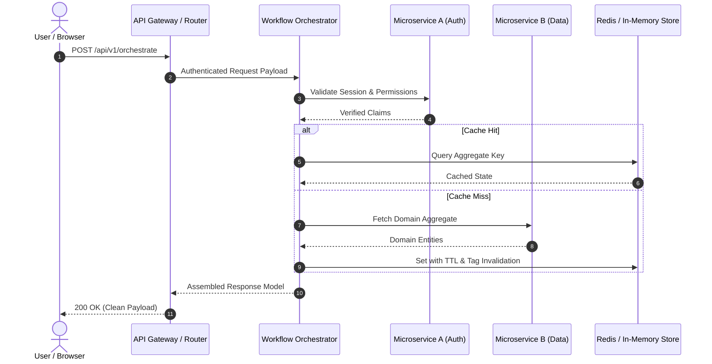

# System Architecture & API Orchestration Patterns

*Architectural principles, design patterns, and engineering practices by [Aashish Mahato](https://github.com/aashish254).*

---

## 1. Core Architectural Pillars

### 1.1 Separation of Concerns & Boundary Enforcement
- **Domain Independence**: Isolate domain entities and core business rules from transport protocols (HTTP/REST, gRPC, WebSockets) and external infrastructure (databases, caches, third-party APIs).
- **Interface Segregation**: Clients should not be forced to depend on interfaces they do not use. Define fine-grained, cohesive contracts for data providers and consumers.

### 1.2 State Isolation & Cache Invalidation
- **Deterministic Eviction**: Explicitly synchronize internal registry state when clearing or resetting component state (e.g. tree structures, virtual DOM nodes, or worker pools) to prevent memory leaks and dangling object references.
- **Partition-Aware Storage**: In client-side storage mechanisms (such as the Web Storage API and Cookies), account for browser state partitioning across top-level origins to prevent cross-origin state contamination.

---

## 2. API Orchestration & Lifecycle Design

### 2.1 Event-Driven Dialogs & User Notification Lifecycle
- **Dual-Phase Lifecycle**: Modern web interactive elements (such as `<dialog>`) follow a two-phase dismissal flow:
  1. **User Action / Close Request**: Browser issues a cancelable event (`cancel`), allowing interception or confirmation before destructive loss of state.
  2. **Terminal Close**: If unprevented, state is committed, the modal backdrop is dismantled, and the `close` event dispatches with the resolved `returnValue`.
- **Hierarchical Visual Assets**: Notifications distinguish between high-contrast application glyphs (`badge`), contextual brand/user marks (`icon`), and content previews (`image`) to fit platform-specific presentation tiers.

---

## 3. Open Source Quality Standards

- **Atomic Commits**: Every commit represents a single logical unit of change with clear motivation and reproducible verification.
- **Specification Alignment**: Documentation and code must strictly adhere to normative specifications (WHATWG, W3C, ECMAScript) rather than ad-hoc browser quirks.
- **Automated Verification**: Linting, typing, and test suites must pass on all target environments prior to merge.
